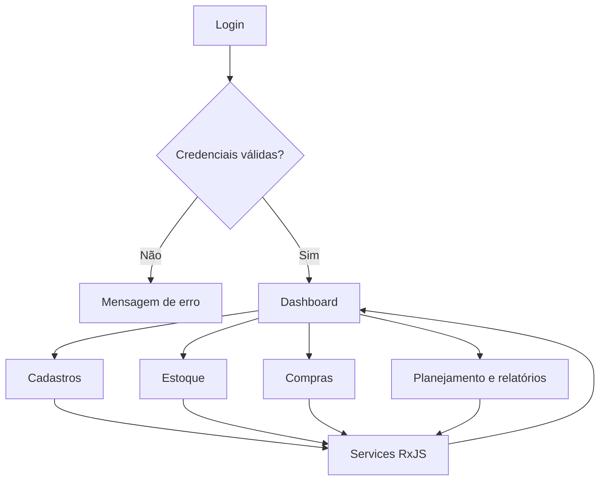

# Painel de Gestão de Estoque e Suprimentos


Aplicação SPA moderna e responsiva para gestão de **produtos, estoque, fornecedores, compras, planejamento e governança**.

O projeto demonstra uma arquitetura frontend com **Angular standalone**, gerenciamento de estado com **RxJS**, regras de negócio, autenticação, autorização, indicadores executivos e testes automatizados.

> Esta versão é um protótipo educacional sem backend. Os dados são mantidos em memória e as operações assíncronas são simuladas com RxJS.

## Demonstração

Ao iniciar a aplicação, utilize:

| Campo | Valor |
| --- | --- |
| Usuário | `admin` |
| Senha | `admin` |

As credenciais são exclusivamente demonstrativas e não representam uma autenticação adequada para produção.

## Principais recursos

- login com sessão temporária e rotas protegidas;
- Dashboard executivo e responsivo;
- tema claro e escuro;
- CRUD de produtos, categorias e usuários;
- controle de depósitos e localizações;
- movimentações e reservas de estoque;
- fornecedores e processo de compras;
- reposição baseada em criticidade;
- inventários e contagem cíclica;
- rastreabilidade por lotes e números de série;
- leitura demonstrativa de códigos;
- devoluções e valorização do estoque;
- previsão de demanda e Curva ABC;
- relatórios gerenciais;
- atividades recentes e auditoria;
- perfis e permissões;
- central de alertas;
- pesquisa, filtros e exportação CSV;
- layout adaptado para desktop, tablet e celular.

## Módulos

| Área | Funcionalidades |
| --- | --- |
| Dashboard | Indicadores, estoque crítico, cobertura, aprovações, alertas e atividades |
| Cadastros | Produtos, categorias, usuários e fornecedores |
| Estoque | Movimentações, depósitos, localizações, reservas e reposição |
| Rastreabilidade | Inventários, contagem cíclica, lotes, séries e códigos |
| Compras | Solicitações, cotações, pedidos e recebimentos |
| Planejamento | Previsão de demanda, cobertura e risco de ruptura |
| Relatórios | Visão geral, valorização, exportação CSV e Curva ABC |
| Administração | Auditoria, perfis, permissões e configurações |

## Dashboard executivo

O Dashboard combina diferentes streams para apresentar:

- quantidade total de produtos;
- produtos ativos;
- produtos com estoque baixo;
- produtos sem estoque;
- valor total do estoque;
- unidades disponíveis;
- cobertura estimada;
- depósitos e reservas ativas;
- solicitações aguardando aprovação;
- alertas não lidos;
- distribuição financeira por categoria;
- produtos que exigem reposição;
- atividades recentes.

Os indicadores são recalculados de maneira reativa sempre que o estado dos services é alterado.

## Arquitetura reativa com RxJS

Os services mantêm o estado privado em `BehaviorSubject` e expõem apenas `Observable` para os componentes.

```typescript
private readonly produtosSubject =
  new BehaviorSubject<Produto[]>([]);

readonly produtos$ =
  this.produtosSubject.asObservable();
```

Streams independentes são combinados para construir as informações das telas:

```typescript
readonly dashboardVm$ = combineLatest([
  this.produtoService.produtos$,
  this.categoriaService.categorias$,
  this.gestaoService.registros$('alertas')
]).pipe(
  map(([produtos, categorias, alertas]) => ({
    produtos,
    categorias,
    alertasNaoLidos:
      alertas.filter(alerta => alerta.status === 'Não lido').length
  }))
);
```

Recursos RxJS utilizados:

- `Observable`;
- `BehaviorSubject`;
- `Subject`;
- `combineLatest`;
- `map`;
- `switchMap`;
- `debounceTime`;
- `distinctUntilChanged`;
- `tap`;
- `delay`;
- `catchError`;
- `finalize`;
- `async pipe`.

## Organização do projeto

```text
src/app/
├── components/
│   ├── dashboard/
│   ├── layout/admin-layout/
│   ├── navbar/
│   ├── sidebar/
│   ├── shared/
│   │   ├── confirm-modal/
│   │   └── toast/
│   └── pages/
│       ├── categoria/
│       ├── deposito/
│       ├── gestao/
│       ├── localizacao/
│       ├── login/
│       ├── movimentacao-estoque/
│       ├── produto/
│       ├── reserva-estoque/
│       └── usuarios/
├── guards/
│   ├── auth.guard.ts
│   └── autorizacao.guard.ts
├── models/
├── services/
├── app.config.ts
├── app.routes.ts
├── app.html
├── app.scss
└── app.ts
```

Os módulos gerenciais utilizam o componente reutilizável `GestaoPage`, configurado por rota, e o `GestaoService`, que mantém coleções reativas por domínio. Essa abordagem evita duplicação de páginas com estrutura semelhante.

## Regras de negócio implementadas

### Produtos

- nome e categoria são obrigatórios;
- preço deve ser maior que zero;
- estoque não pode ser negativo;
- produtos com menos de cinco unidades são considerados críticos;
- somente categorias ativas podem ser selecionadas.

### Categorias

- nome obrigatório e único;
- categoria utilizada por produto não pode ser removida;
- categorias podem ser ativadas ou desativadas.

### Usuários

- nome e e-mail são obrigatórios;
- e-mail não pode ser duplicado;
- o último administrador ativo não pode ser removido ou desativado.

### Estoque

- saída não pode deixar saldo negativo;
- movimentações atualizam o saldo do produto;
- transferências exigem origem e destino diferentes;
- reservas reduzem o saldo disponível;
- depósitos com estoque e localizações ocupadas possuem proteção;
- operações relevantes geram atividades.

### Gestão

- registros possuem status, prioridade e responsável;
- mudanças de status geram histórico;
- alertas podem ser marcados como lidos;
- relatórios podem ser exportados em CSV;
- telas administrativas passam por autenticação e autorização.

## Tecnologias

| Tecnologia | Utilização |
| --- | --- |
| Angular 21 | Framework SPA e componentes standalone |
| TypeScript 5.9 | Tipagem e implementação |
| RxJS 7 | Estado e fluxos assíncronos |
| Angular Router | Navegação e proteção de rotas |
| Angular Forms | Formulários e validações |
| Bootstrap 5 | Layout e componentes responsivos |
| Bootstrap Icons | Identidade visual |
| Vitest | Testes automatizados |
| sessionStorage | Sessão demonstrativa |
| localStorage | Preferência de tema |

## Como executar

### Pré-requisitos

- Node.js compatível com Angular 21;
- npm 11 ou superior.

### Instalação

```bash
git clone https://github.com/jeanalgoritimo/frontend.git
cd frontend
npm ci
```

### Execução

```bash
npm start
```

Acesse:

```text
http://localhost:4200
```

### Testes

```bash
npm test -- --watch=false
```

Resultado de referência:

```text
Test Files  24 passed
Tests       53 passed
```

### Build de produção

```bash
npm run build
```

Os arquivos são gerados em:

```text
dist/frontend
```

## Fluxo da aplicação



## Testes automatizados

A suíte utiliza Vitest e Angular Testing Utilities para validar:

- componentes;
- autenticação;
- proteção de rotas;
- autorização;
- services;
- regras de estoque;
- indicadores gerenciais;
- alteração de status;
- alertas;
- tema da aplicação.

## Limitações atuais

- dados mantidos somente em memória;
- alterações são perdidas ao atualizar a página;
- autenticação local fixa;
- ausência de API e banco de dados;
- permissões demonstrativas;
- previsão de demanda baseada em dados simulados;
- leitura de código sem integração com câmera ou coletor;
- ausência de integração fiscal e contábil.

## Próximas evoluções

- ASP.NET Core Web API;
- SQL Server ou Azure SQL;
- Entity Framework Core;
- autenticação JWT ou Microsoft Entra ID;
- autorização baseada em policies;
- persistência de estoque e movimentações;
- concorrência otimista;
- auditoria no backend;
- SignalR para atualizações em tempo real;
- integração com leitores de código;
- geração de relatórios em PDF;
- observabilidade e logs estruturados;
- Docker e pipeline CI/CD;
- previsão de demanda com Machine Learning.

## Segurança

Não utilize a autenticação `admin/admin` em produção.

Em uma implementação real:

- autentique no backend;
- armazene senhas com hash seguro;
- utilize HTTPS;
- proteja tokens;
- implemente expiração e renovação de sessão;
- valide permissões no servidor;
- mantenha segredos fora do frontend;
- registre auditoria das operações críticas.

## Documentação complementar

Consulte [IMPLEMENTACAO.md](./IMPLEMENTACAO.md) para detalhes sobre os módulos, arquitetura e comandos de validação.

## Autor

**Jean Paiva da Silva**

- GitHub: [@jeanalgoritimo](https://github.com/jeanalgoritimo)
- LinkedIn: [Jean Silva](https://www.linkedin.com/in/jean-silva-62b65b159/)

Projeto desenvolvido para estudo, portfólio e demonstração de Angular, RxJS, arquitetura frontend e sistemas corporativos de gestão.
